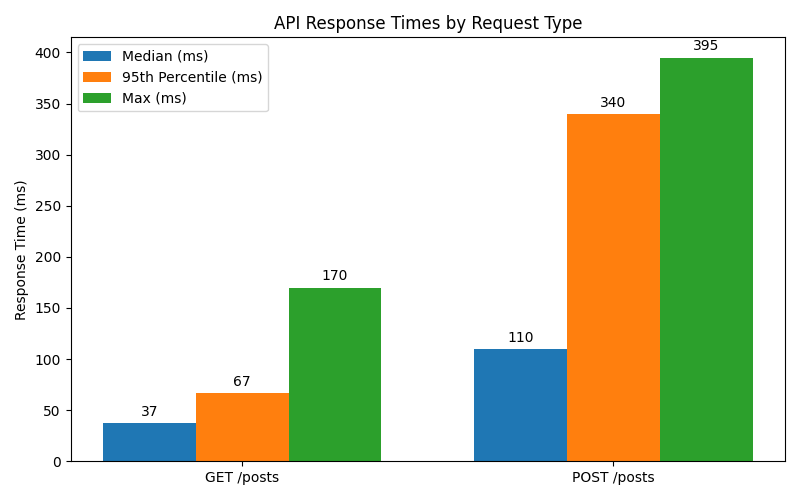

# Load Test Results Summary

During this phase of testing, I used Locust to simulate concurrent users hitting the `/posts` endpoint of the JSONPlaceholder API to evaluate its performance and stability under load. Initial tests simulated 10 users with a spawn rate of 2, with no failures observed, indicating stable handling of light traffic.

Subsequently, I increased the load to 50 users with a spawn rate of 10 users/second and expanded the test to include both GET and POST requests to better mimic real-world usage. Over the course of these tests, a total of 846 GET requests and 175 POST requests were sent, with zero failures recorded, demonstrating reliable API responsiveness under moderate to heavy traffic.

## Key Performance Metrics

| Request Type | # Requests | # Failures | Avg Response Time (ms) | Median (ms) | 95th Percentile (ms) | Max (ms) | Req/s  |
|--------------|------------|------------|------------------------|-------------|----------------------|----------|--------|
| GET /posts   | 846        | 0          | 43                     | 37          | 67                   | 170      | 19.18  |
| POST /posts  | 175        | 0          | 163                    | 110         | 340                  | 395      | 6.9    |

These results suggest that the API performs well under the simulated conditions with minimal latency and no request failures. Further testing with higher loads or longer durations could provide additional insights into performance thresholds and scalability.
